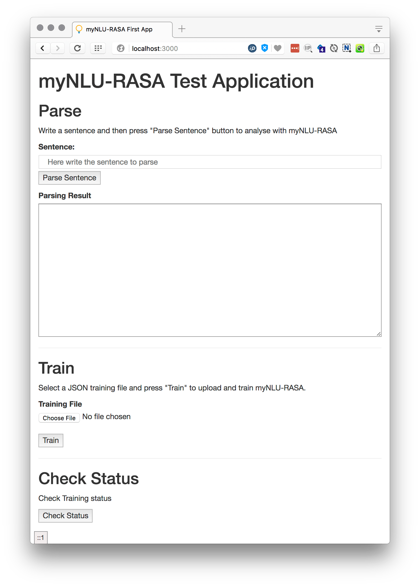
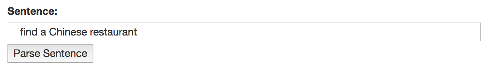
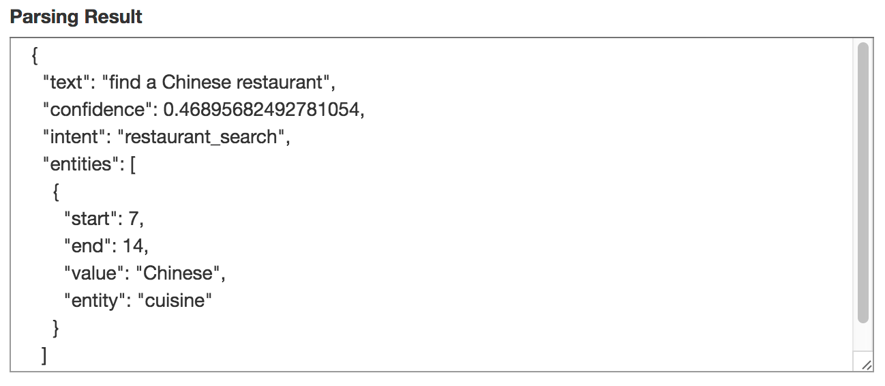

# myNLU Rasa in 3 minutes
You will need to have installed command line versions of:
`heroku`
`node`
`npm`
`git`

### Required Tools Links

- HEROKU CLI Installation: https://devcenter.heroku.com/articles/heroku-cli
- Node & NPM Installers: https://nodejs.org/en/download/
- Git Installation: https://git-scm.com/book/en/v2/Getting-Started-Installing-Git


## Get the myNLU Rasa quickstart and configure it

From the command line clone the repository into a mynlu-qs directory:
```sh
git clone https://github.com/AzumoHQ/mynlu_quickstart.git mynlu-qs`
```

Go into that directory:
```sh
cd mynlu-qs
```


Install node dependencies:
```sh
npm install
```

Setup the application with the name `mynlu-qs-test` (you WILL need to choose another name):
```sh
npm run setup -- mynlu-qs-test
```


This final step will check that you have heroku, npm, node, git installed, create a Heroku app with the name 
`mynlu-qs-test`, provision the mynlu-rasa add-on, and create a local `.env` file with the settings for your 
`mynlu-rasa` access. 

You’re good to go!

## Starting your app locally
From the command line run:
```sh
npm run start
```

Now point your browser to: `http://localhost:3000`

You'll be able to see this:



You need to train your model, press "Choose File" and select a training file, you can find one of exame  under `model/demo_rasa.json`, then press "Train" button.

After you've trained your model at least once, you can type on the sentence text box and click on the "Parse Sentence" button:


The app will call your `mynlu-rasa` instance and show the results below.


## Grooming your model

You can edit the example training file: `./model/demo_rasa.json` or create your own file and upload it using the "Train" section. 


## Final words
You can deploy your new app to Heroku via git, check out this tutorial here: https://devcenter.heroku.com/articles/git


